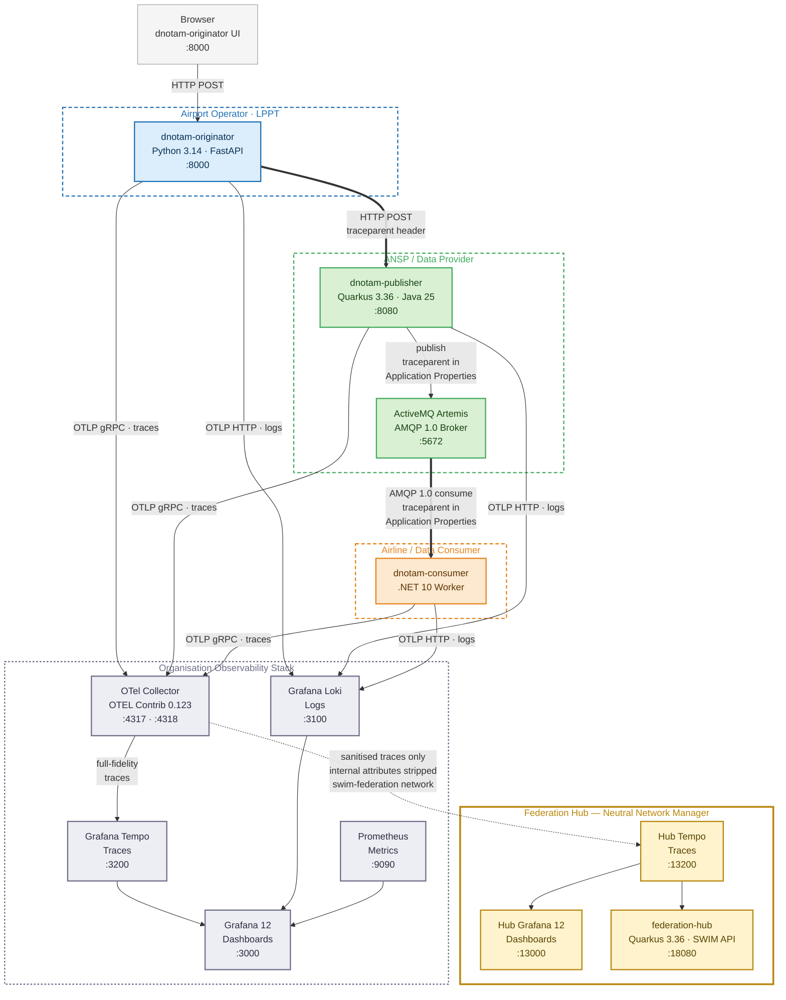

# SWIM Yellow Profile: Distributed Tracing Demo

Proof-of-concept for the **SWIM Foundation Group (SFG)** validating the proposal to add W3C Trace Context propagation as a wire-level requirement in **EUROCONTROL SPEC-170 (SWIM-TI Yellow Profile)**.

---

## Why this matters

The Yellow Profile mandates AMQP 1.0 and HTTP/REST as protocol bindings, but says nothing about how observability metadata crosses protocol boundaries. In multi-provider environments (where an airport, an ANSP, and an airline each run independent infrastructure), a single operational transaction (a DNOTAM) crosses multiple organisation borders, each potentially using a different technology stack.

Without a standardised mechanism to carry a correlation identifier across those boundaries, it is impossible to answer:

> *"This DNOTAM was published at 10:42 UTC. Why is the federation hub flagging it as invalid at 10:42:03?"*

This demo proves that the W3C `traceparent` header solves this, and that it can be carried through AMQP 1.0 Application Properties without modifying the aviation payload.

---

## Three questions this demo answers

### "How does the Trace ID survive the HTTP→AMQP boundary without touching the aviation payload?"

When the originator dispatches a DNOTAM over HTTP, the `traceparent` header travels with the request. The publisher receives it, creates a child span, and, before emitting the AMQP message, calls `inject()` from the W3C Propagators API, writing the `traceparent` string into the message's **Application Properties**. The aviation payload is untouched. The consumer calls `extract()` on arrival, reconstructing the span context before any business logic runs. One 32-character Trace ID, invariant from the first HTTP call to the last AMQP consume. This is the wire-level behaviour that SPEC-170 should standardise.

### "Does this mandate OpenTelemetry? Can we use any compliant implementation?"

The `traceparent` injected into AMQP Application Properties is a plain string defined by the W3C. The Application Properties section is defined by OASIS (AMQP 1.0 spec). Neither is OpenTelemetry-specific. Any AMQP 1.0 client (Apache Qpid, IBM MQ, Azure Service Bus, RabbitMQ with the AMQP plugin) can read and write it without an OTel SDK. OpenTelemetry is used here as the reference implementation because it is the most widely adopted. The wire format is the standard; the SDK is a convenience.

### "How do we guarantee that aviation business events are never mixed with infrastructure noise?"

Every log line emitted by the application carries three mandatory fields: `swim_perimeter: SERVICE_LAYER`, `event_type` (`OPERATIONAL_EVENT` or `VALIDATION_FAILURE`), and `service_context: dNOTAM`. This taxonomy is enforced in code, not in log filters, not in dashboards, not in post-processing. Infrastructure events (broker connections, container health, network retries) are never written by the application. What reaches Loki is exclusively business semantics.

### "In a multi-organisation trace, who is who?"

Each service declares its owning organisation via the OpenTelemetry `service.namespace` resource attribute (`lisbon-airport`, `nav-portugal`, `tap-air-portugal`). The originator also injects a W3C `baggage` header carrying `org.icao=LPPT` alongside the `traceparent`. Both travel through every protocol boundary using the same `inject`/`extract` mechanism. The consumer logs the ICAO code as a structured field (`org_icao=LPPT`); the Federation Hub exposes it in the REST response. See [Organisation identity](docs/deep-dive.md#organisation-identity-and-context-propagation) in the deep dive.

---

## Architecture

### Federated multi-organisation view

This is the production model proposed for SPEC-170. Each organisation runs its own service and observability stack. The Federation Hub aggregates curated telemetry using only the W3C `traceparent` as the correlation key, with no access to internal logs, metrics, or platform details.



> **Key insight:** the three services run at different organisations with different technology stacks. The `traceparent` is the only thing they share. The OTel Collector strips internal attributes (host names, process IDs, SDK versions) before forwarding to the Federation Hub; each organisation controls what it exposes.

### How trace context crosses protocol boundaries

The `traceparent` header survives the HTTP → AMQP protocol boundary through AMQP Application Properties. The aviation payload is never modified.

```mermaid
flowchart LR
    subgraph ORIGIN["1 · Airport dispatches DNOTAM"]
        O_SPAN["new trace span\ntrace-id created here"]
    end

    subgraph HTTP_HOP["2 · HTTP boundary"]
        H_HDR["traceparent header\n00-4bf9...4736-aaa1-01"]
    end

    subgraph AMQP_PUB["3 · AMQP publish"]
        A_PROP["Application Properties\ntraceparent = 00-4bf9...4736-bbb2-01"]
    end

    subgraph AMQP_CON["4 · AMQP consume"]
        C_EXT["Propagator.Extract\ntraceparent = 00-4bf9...4736-ccc3-01"]
    end

    O_SPAN ==>|"inject into\nHTTP header"| H_HDR
    H_HDR ==>|"inject into\nAMQP App Properties"| A_PROP
    A_PROP ==>|"extract from\nApp Properties"| C_EXT

    classDef step fill:#f0f4ff,stroke:#3366cc,stroke-width:2px,color:#1a1a2e
    class O_SPAN,H_HDR,A_PROP,C_EXT step

    style ORIGIN fill:none,stroke:#2171b5,stroke-width:2px,stroke-dasharray:6 4,color:#2171b5
    style HTTP_HOP fill:none,stroke:#41ab5d,stroke-width:2px,stroke-dasharray:6 4,color:#41ab5d
    style AMQP_PUB fill:none,stroke:#e6841e,stroke-width:2px,stroke-dasharray:6 4,color:#e6841e
    style AMQP_CON fill:none,stroke:#8b5cf6,stroke-width:2px,stroke-dasharray:6 4,color:#8b5cf6
```



> **trace-id** (`4bf9...4736`) is invariant across all four hops: the 32-character correlation key. Only the **parent-id** changes at each service boundary, creating the parent→child span relationships that Tempo renders as a waterfall timeline.

---

## Services

| Service | Technology | Role | Port |
|---|---|---|---|
| dnotam-originator | Python 3.14, FastAPI | Web UI · dispatches DNOTAM via HTTP REST | 8000 |
| dnotam-publisher | Quarkus 3.36.1, Java 25 | Receives HTTP · publishes to AMQP | 8080 |
| dnotam-consumer | .NET 10 Worker | Consumes AMQP · validates · logs | — |
| federation-hub | Quarkus 3.36.1, Java 25 | Federation query API | 18080 |
| ActiveMQ Artemis | Apache 2.40 | AMQP 1.0 broker | 5672, 8161 |
| OTel Collector | OTEL Contrib 0.123.0 | Span fan-out (org → hub) | 4317, 4318 |
| Grafana Tempo | 3.x (latest) | Distributed traces (org) | 3200 |
| Grafana Loki | latest | Log aggregation | 3100 |
| Prometheus | latest | Metrics | 9090 |
| Grafana | 12.4.4 | Dashboards (org) | 3000 |
| Hub Tempo | 3.x (latest) | Distributed traces (federation) | 13200 |
| Hub Grafana | 12.4.4 | Dashboards (federation) | 13000 |

---

## Two demonstration scenarios

This project supports two distinct demonstrations. They are not variations of the same thing; they answer different questions.

### Scenario A: Fully internal stack

```
[Originator] --HTTP--> [Publisher] --AMQP--> [Consumer]
      |                    |                    |
      └────────────────────┴────────────────────┘
                           |
                    [Local Grafana + Tempo + Loki + Prometheus]
```

**What it proves:** a single organisation (e.g. an ANSP) can implement end-to-end distributed tracing across three services in three different languages, with a single `traceparent` crossing the HTTP→AMQP protocol boundary. All telemetry stays inside the organisation's own infrastructure.

**The key point for the audience:** the `traceparent` survives the protocol change from HTTP to AMQP. The aviation payload is untouched. This is the wire-level behaviour that SPEC-170 should standardise.

---

### Scenario B: Federated view

```
[Originator] --HTTP--> [Publisher] --AMQP--> [Consumer]
      |                    |                    |
      └──────── OTel Collector (fan-out) ───────┘
                    |                 |
          [Org Tempo/Grafana]   [Hub Tempo]
                                      |
                             [Federation Hub API]
                             [Hub Grafana]
```

**What it proves:** in a multi-organisation environment (different ANSPs, AISPs, airlines), a neutral federation hub can aggregate telemetry from all parties using only the `traceparent` as the correlation key, without accessing internal logs, metrics, or platform details. Each organisation controls what it shares (only curated span attributes reach the hub, internal SDK/host/process data is stripped at the OTel Collector).

**This is the production model.** In the real world, each organisation runs its own stack (Scenario A). A neutral federation hub plays the hub role, correlating traces across organisational boundaries to detect end-to-end anomalies without requiring access to anyone's internal infrastructure.

**The key point for the audience:** the same 32-character Trace ID that originated inside one organisation's internal stack is the key that the Federation Hub uses to reconstruct the full cross-organisation journey. No bilateral agreements, no proprietary connectors. Just the W3C `traceparent` standard.

---

## Quick start

This is the single operational guide. Follow the steps in order.

### Prerequisites

| Tool | macOS/Linux | Windows |
|---|---|---|
| Container runtime | [Podman Desktop](https://podman-desktop.io) | [Podman Desktop](https://podman-desktop.io) |
| Build tool | `make` (pre-installed on most distros) | Not needed; use PowerShell scripts |
| Source control | `git` | `git` |

No language runtimes required; everything runs in containers.

**Windows only: one-time setup**

Install the Compose provider (pick one):

| Tool | Command |
|---|---|
| Chocolatey | `choco install podman-compose` |
| pip | `pip install podman-compose` |
| Podman Desktop | Settings → Resources → Compose → Setup |

Verify with `podman compose version`. If PowerShell blocks scripts, run once:
```powershell
Set-ExecutionPolicy -Scope CurrentUser RemoteSigned
```

---

### Step 1: Clone

```bash
git clone https://github.com/swim-developer/swim-sfg-observability.git
cd swim-sfg-observability
```

### Step 2: Build images (first time only)

| macOS/Linux | Windows (PowerShell) |
|---|---|
| `make build` | `.\scripts\windows\build.ps1` |

> Builds all images including the Federation Hub. Takes a few minutes on first run.

### Step 3: Start the stack

| macOS/Linux | Windows (PowerShell) |
|---|---|
| `make up` | `.\scripts\windows\up.ps1` |

Wait ~15 seconds, then open these URLs in your browser and keep them open for the rest of the demo:

| UI | URL |
|---|---|
| DNOTAM Originator | [http://localhost:8000](http://localhost:8000) |
| Grafana | [http://localhost:3000](http://localhost:3000) |
| Artemis Console | [http://localhost:8161](http://localhost:8161) (login: admin / admin) |

### Step 4: Run Scenario A

With the stack running, trigger the scenarios from the terminal:

| Action | macOS/Linux | Windows (PowerShell) |
|---|---|---|
| Dispatch valid DNOTAM | `make demo-valid` | `.\scripts\windows\demo-valid.ps1` |
| Dispatch invalid DNOTAM | `make demo-invalid` | `.\scripts\windows\demo-invalid.ps1` |

Or use the browser: open [http://localhost:8000](http://localhost:8000) and click **Dispatch** on either card.

Watch the results in Grafana at [http://localhost:3000](http://localhost:3000). The dashboard auto-refreshes every 2 seconds.

### Step 5: Add the Federation Hub

The stack from Step 3 is still running. Add the hub on top with no restart needed:

| macOS/Linux | Windows (PowerShell) |
|---|---|
| `make hub-up` | `.\scripts\windows\hub-up.ps1` |

Wait ~10 seconds, then open:

| UI | URL |
|---|---|
| Hub Grafana | [http://localhost:13000](http://localhost:13000) |
| Federation Hub API | [http://localhost:18080](http://localhost:18080) |

Dispatch any DNOTAM again; the trace will appear in both Grafana (org) and Hub Grafana simultaneously.

### Step 6: Stop everything when done

| macOS/Linux | Windows (PowerShell) |
|---|---|
| `make hub-down` | `.\scripts\windows\hub-down.ps1` |
| `make down` | `.\scripts\windows\down.ps1` |

---

## Command reference

| Action | macOS / Linux | Windows (PowerShell) |
|---|---|---|
| **Build** | | |
| Build all 4 images | `make build` | `.\scripts\windows\build.ps1` |
| **Main stack** | | |
| Start full stack (9 containers) | `make up` | `.\scripts\windows\up.ps1` |
| Stop full stack | `make down` | `.\scripts\windows\down.ps1` |
| Show container status | `make status` | `.\scripts\windows\status.ps1` |
| **Federation hub** | | |
| Start hub stack (3 containers) | `make hub-up` | `.\scripts\windows\hub-up.ps1` |
| Stop hub stack | `make hub-down` | `.\scripts\windows\hub-down.ps1` |
| **Demo** | | |
| Dispatch valid DNOTAM (runway 27R) | `make demo-valid` | `.\scripts\windows\demo-valid.ps1` |
| Dispatch invalid DNOTAM (runway ZZ9) | `make demo-invalid` | `.\scripts\windows\demo-invalid.ps1` |
| **Logs** | | |
| Tail consumer logs | `make logs-consumer` | `.\scripts\windows\logs-consumer.ps1` |
| Tail publisher logs | `make logs-publisher` | `.\scripts\windows\logs-publisher.ps1` |

**Service URLs** (open in browser after `make up` / `up.ps1`):

| Service | URL |
|---|---|
| Originator UI | http://localhost:8000 |
| Grafana (local stack) | http://localhost:3000 |
| Grafana (federation hub) | http://localhost:13000 |
| Federation Hub API | http://localhost:18080/v1/federation/traces/{traceId} |
| Artemis console | http://localhost:8161 (login: admin / admin) |

---

## Further reading

- [Technical deep dive](docs/deep-dive.md): scenario walkthrough, federation hub internals, observability concepts, traceparent anatomy, and references
