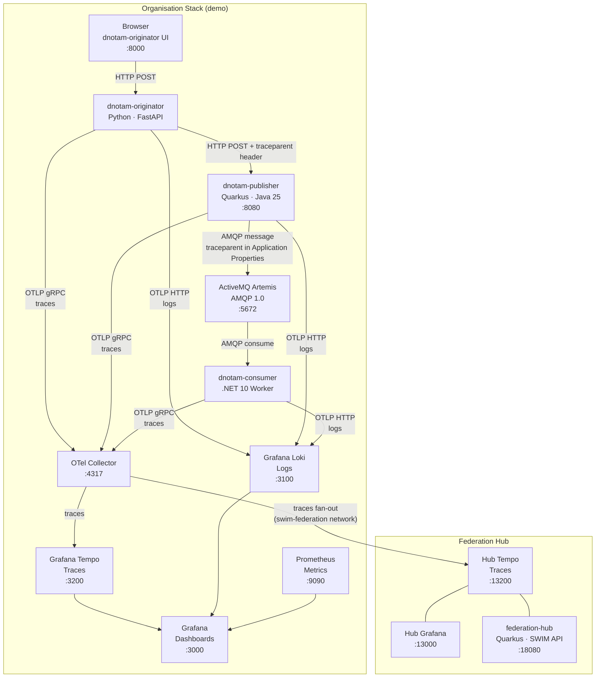

# SWIM Yellow Profile — Distributed Tracing Demo

Proof-of-concept for the **SWIM Foundation Group (SFG)** validating the proposal to add W3C Trace Context propagation as a wire-level requirement in **EUROCONTROL SPEC-170 (SWIM-TI Yellow Profile)**.

---

## Why this matters

The Yellow Profile mandates AMQP 1.0 and HTTP/REST as protocol bindings, but says nothing about how observability metadata crosses protocol boundaries. In multi-provider environments — where an airport, an ANSP, and an airline each run independent infrastructure — a single operational transaction (a DNOTAM) crosses multiple organisation borders, each potentially using a different technology stack.

Without a standardised mechanism to carry a correlation identifier across those boundaries, it is impossible to answer:

> *"This DNOTAM was published at 10:42 UTC — why is the federation hub flagging it as invalid at 10:42:03?"*

This demo proves that the W3C `traceparent` header solves this — and that it can be carried through AMQP 1.0 Application Properties without modifying the aviation payload.

---

## The three stakeholder concerns

| Stakeholder | Concern | How this demo answers it |
|---|---|---|
| **Stakeholder A** | How does trace context cross HTTP→AMQP? | The `traceparent` is injected into AMQP Application Properties. The consumer extracts it before processing, re-attaching to the same trace tree. |
| **Stakeholder B** | Does this lock us into a vendor? | W3C Trace Context is a browser/industry standard. AMQP Application Properties is an OASIS standard. Any vendor implementation can read/write both. |
| **Stakeholder C** | How do we separate infrastructure noise from business events? | A `SERVICE_LAYER` taxonomy is enforced in code. Infrastructure metrics (broker latency, network) stay in the platform layer. Application logs carry only business semantics. |

---

## Architecture



### How trace context flows

```
1. Browser triggers POST /publish/valid
2. dnotam-originator creates a new trace span (traceparent auto-generated by OTel SDK)
3. originator HTTP client injects traceparent header into the POST to dnotam-publisher
4. dnotam-publisher receives the HTTP call — OTel auto-propagates the trace context
5. publisher serialises the NOTAM to JSON and emits an AMQP message
6. SmallRye Reactive Messaging + Quarkus OTel inject traceparent/tracestate
   into the AMQP message Application Properties section
7. dnotam-consumer receives the AMQP message
8. consumer reads traceparent from Application Properties
9. consumer calls Propagator.Extract() to re-link its activity to the original trace
10. consumer's span appears as a child of the publisher's AMQP span in Grafana
```

This is the wire-level proof: the same 32-character Trace ID appears in HTTP headers, AMQP Application Properties, and all three services' logs — without touching the aviation payload.

---

## Services

| Service | Technology | Role | Port |
|---|---|---|---|
| dnotam-originator | Python 3.14, FastAPI | Web UI · dispatches DNOTAM via HTTP REST | 8000 |
| dnotam-publisher | Quarkus 3.36.1, Java 25 | Receives HTTP · publishes to AMQP | 8080 |
| dnotam-consumer | .NET 10 Worker | Consumes AMQP · validates · logs | — |
| federation-hub | Quarkus 3.36.1, Java 25 | Federation query API | 18080 |
| ActiveMQ Artemis | Apache 2.40 | AMQP 1.0 broker | 5672, 8161 |
| OTel Collector | OTEL Contrib 0.123.0 | Span fan-out (org → hub) | 4317, 4318 |
| Grafana Tempo | 3.x (latest) | Distributed traces (org) | 3200 |
| Grafana Loki | latest | Log aggregation | 3100 |
| Prometheus | latest | Metrics | 9090 |
| Grafana | 12.4.4 | Dashboards (org) | 3000 |
| Hub Tempo | 3.x (latest) | Distributed traces (federation) | 13200 |
| Hub Grafana | 12.4.4 | Dashboards (federation) | 13000 |

---

## Two demonstration scenarios

This project supports two distinct demonstrations. They are not variations of the same thing — they answer different questions.

### Scenario A — Fully internal stack (single organisation)

```
[Originator] --HTTP--> [Publisher] --AMQP--> [Consumer]
      |                    |                    |
      └────────────────────┴────────────────────┘
                           |
                    [Local Grafana + Tempo + Loki + Prometheus]
```

**What it proves:** a single organisation (e.g. an ANSP) can implement end-to-end distributed tracing across three services in three different languages, with a single `traceparent` crossing the HTTP→AMQP protocol boundary. All telemetry stays inside the organisation's own infrastructure.

**The key point for the audience:** the `traceparent` survives the protocol change from HTTP to AMQP. The aviation payload is untouched. This is the wire-level behaviour that SPEC-170 should standardise.

---

### Scenario B — Federated view (federation hub)

```
[Originator] --HTTP--> [Publisher] --AMQP--> [Consumer]
      |                    |                    |
      └──────── OTel Collector (fan-out) ───────┘
                    |                 |
          [Org Tempo/Grafana]   [Hub Tempo]
                                      |
                             [Federation Hub API]
                             [Hub Grafana]
```

**What it proves:** in a multi-organisation environment (different ANSPs, AISPs, airlines), a neutral federation hub can aggregate telemetry from all parties using only the `traceparent` as the correlation key — without accessing internal logs, metrics, or platform details. Each organisation controls what it shares (only curated span attributes reach the hub, internal SDK/host/process data is stripped at the OTel Collector).

**This is the production model.** In the real world, each organisation runs its own stack (Scenario A). A neutral federation hub plays the hub role, correlating traces across organisational boundaries to detect end-to-end anomalies without requiring access to anyone's internal infrastructure.

**The key point for the audience:** the same 32-character Trace ID that originated inside one organisation's internal stack is the key that the Federation Hub uses to reconstruct the full cross-organisation journey. No bilateral agreements, no proprietary connectors — just the W3C `traceparent` standard.

---

## Quick start

This is the single operational guide. Follow the steps in order.

### Prerequisites

| Tool | macOS/Linux | Windows |
|---|---|---|
| Container runtime | [Podman Desktop](https://podman-desktop.io) | [Podman Desktop](https://podman-desktop.io) |
| Build tool | `make` (pre-installed on most distros) | Not needed — use PowerShell scripts |
| Source control | `git` | `git` |

No language runtimes required — everything runs in containers.

**Windows only — one-time setup:**

Install the Compose provider (pick one):

| Tool | Command |
|---|---|
| Chocolatey | `choco install podman-compose` |
| pip | `pip install podman-compose` |
| Podman Desktop | Settings → Resources → Compose → Setup |

Verify with `podman compose version`. If PowerShell blocks scripts, run once:
```powershell
Set-ExecutionPolicy -Scope CurrentUser RemoteSigned
```

---

### Step 1 — Clone

```bash
git clone https://github.com/swim-developer/swim-sfg-observability.git
cd swim-sfg-observability
```

### Step 2 — Build images (first time only)

| macOS/Linux | Windows (PowerShell) |
|---|---|
| `make build` | `.\scripts\windows\build.ps1` |

> Builds all images including the Federation Hub. Takes a few minutes on first run.

### Step 3 — Start the stack

| macOS/Linux | Windows (PowerShell) |
|---|---|
| `make up` | `.\scripts\windows\up.ps1` |

Wait ~15 seconds, then open these URLs in your browser — keep them open for the rest of the demo:

| UI | URL |
|---|---|
| DNOTAM Originator | [http://localhost:8000](http://localhost:8000) |
| Grafana | [http://localhost:3000](http://localhost:3000) |
| Artemis Console | [http://localhost:8161](http://localhost:8161) — admin / admin |

### Step 4 — Run Scenario A (valid and invalid DNOTAM)

With the stack running, trigger the scenarios from the terminal:

| Action | macOS/Linux | Windows (PowerShell) |
|---|---|---|
| Dispatch valid DNOTAM | `make demo-valid` | `.\scripts\windows\demo-valid.ps1` |
| Dispatch invalid DNOTAM | `make demo-invalid` | `.\scripts\windows\demo-invalid.ps1` |

Or use the browser: open [http://localhost:8000](http://localhost:8000) and click **Dispatch** on either card.

Watch the results in Grafana at [http://localhost:3000](http://localhost:3000) — the dashboard auto-refreshes every 2 seconds.

### Step 5 — Add the Federation Hub (Scenario B)

The stack from Step 3 is still running. Add the hub on top — no restart needed:

| macOS/Linux | Windows (PowerShell) |
|---|---|
| `make hub-up` | `.\scripts\windows\hub-up.ps1` |

Wait ~10 seconds, then open:

| UI | URL |
|---|---|
| Hub Grafana | [http://localhost:13000](http://localhost:13000) |
| Federation Hub API | [http://localhost:18080](http://localhost:18080) |

Dispatch any DNOTAM again — the trace now appears in both Grafana (org) and Hub Grafana simultaneously.

### Step 6 — Stop everything when done

| macOS/Linux | Windows (PowerShell) |
|---|---|
| `make hub-down` | `.\scripts\windows\hub-down.ps1` |
| `make down` | `.\scripts\windows\down.ps1` |

---

## Scenarios

### Scenario 1 — Valid DNOTAM (runway 27R)

**Linux / macOS:**
```bash
make demo-valid
```

**Windows:**
```powershell
.\scripts\windows\demo-valid.ps1
```

What happens internally:
1. The originator creates a `traceparent` header (e.g. `00-5d6b583f...-01`) and POSTs the NOTAM to the publisher
2. The publisher receives the header, propagates the trace context, and emits an AMQP message with `traceparent` in Application Properties
3. The consumer reads the AMQP message, extracts `traceparent`, validates runway `27R` (valid format), and logs an `OPERATIONAL_EVENT`
4. All three services export their spans to the OTel Collector, which forwards them to both local Tempo and Hub Tempo

Expected output:
```
Trace ID: 5d6b583f1f9a86a8bcec97d56db5cd8a
Status  : 202
Runway  : 27R
```

Verify logs:

**Linux / macOS:**
```bash
make logs-consumer
```

**Windows:**
```powershell
.\scripts\windows\logs-consumer.ps1
```

Expected: `[SERVICE_LAYER][OPERATIONAL_EVENT] DNOTAM integrated for flight operation at LPPT | traceparent=00-5d6b583f...-03`

Verify trace in Grafana → Explore → Tempo → search by Trace ID.

---

### Scenario 2 — Invalid DNOTAM (runway ZZ9)

**Linux / macOS:**
```bash
make demo-invalid
```

**Windows:**
```powershell
.\scripts\windows\demo-invalid.ps1
```

What happens internally:
1. Same as Scenario 1, but the runway code is `ZZ9` — not a valid ICAO runway designator
2. The publisher does NOT validate — it publishes the AMQP message as-is (correct behaviour: the publisher is a transport relay, not a validator)
3. The consumer receives the message, extracts `traceparent`, checks the runway pattern `\d{2}[LRC]?` — `ZZ9` fails
4. The consumer logs a `VALIDATION_FAILURE` and marks the span as `ERROR`

Verify logs:

**Linux / macOS:**
```bash
make logs-consumer
```

**Windows:**
```powershell
.\scripts\windows\logs-consumer.ps1
```

Expected output in consumer logs:
```
[SERVICE_LAYER][VALIDATION_FAILURE] Invalid runway code 'ZZ9' for aerodrome LPPT | traceparent=00-ab9e9b45...-03
```

In Grafana Tempo, the `dnotam.process` span appears red (ERROR status) with the message "Invalid runway code". You can navigate from the red span back to the originator span to see exactly when and where the invalid data entered the chain.

Why is this powerful: the consumer is at a different organisation with no direct access to the originator. The `traceparent` is the only link. Following it in Grafana reconstructs the entire chain without any organisation needing to share private logs.

---

## Federation Hub

### What it models

In real SWIM deployments, an airport, an ANSP, and an airline each run their own observability stack. There is no shared Grafana. The W3C Trace Context proposal for SPEC-170 requires that the `traceparent` be standardised at the wire level — not the platform level.

The Federation Hub models a **neutral federation point**: a central service that receives spans from all organisations via a shared network (`swim-federation`), stores them in an independent Tempo, and exposes a SWIM-style REST API to query cross-organisation traces by Trace ID.

### How it works technically

The OTel Collector is the key component. It uses **two distinct pipelines** so that internal and federated views have different fidelity:

```yaml
# infra/otel-collector.yaml (simplified)
processors:
  batch: ...

  transform/hub-sanitize:
    trace_statements:
      - context: resource
        statements:
          - delete_key(resource.attributes, "telemetry.sdk.language")
          - delete_key(resource.attributes, "telemetry.sdk.name")
          - delete_key(resource.attributes, "telemetry.sdk.version")
          - delete_key(resource.attributes, "service.instance.id")
          - delete_key(resource.attributes, "deployment.environment")
          # ... and host.*, process.*, os.* attributes
      - context: span
        statements:
          - keep_keys(span.attributes, ["notam.id", "notam.aerodrome",
              "notam.type", "messaging.system", "messaging.destination.name",
              "http.method", "http.route", "http.status_code"])

service:
  pipelines:
    traces/local:                             # full fidelity — always active
      receivers: [otlp]
      processors: [batch]
      exporters: [otlp/local]

    # traces/hub:                             # curated federation export
    #   receivers: [otlp]                     # uncommented automatically by make hub-up
    #   processors: [transform/hub-sanitize, batch]
    #   exporters: [otlp/hub]
```

**What each pipeline sees:**

| Attribute | Local Tempo | Hub Tempo |
|---|---|---|
| `service.name`, `service.namespace` | ✅ | ✅ |
| `notam.id`, `notam.aerodrome`, `notam.type`, `notam.runway` | ✅ | ✅ |
| `messaging.system`, `messaging.destination.name` | ✅ | ✅ |
| `deployment.environment` | ✅ | ❌ stripped |
| `service.instance.id` | ✅ | ❌ stripped |
| `telemetry.sdk.*`, `host.*`, `process.*`, `os.*` | ✅ | ❌ stripped |

This models the Network Manager pattern: each organisation shares correlation context (Trace ID, service names, aviation business fields) without exposing internal platform details. Services are unaware of the hub — they send to one endpoint (the Collector), and routing is transparent.

### Query the federation hub

After running both scenarios:

```bash
# Replace with your actual Trace ID from make demo-valid
curl http://localhost:18080/v1/federation/traces/5d6b583f1f9a86a8bcec97d56db5cd8a | jq .
```

Response:
```json
{
  "traceId": "5d6b583f1f9a86a8bcec97d56db5cd8a",
  "participants": ["dnotam-originator", "dnotam-publisher", "dnotam-consumer"],
  "spans": [...],
  "totalDurationMicros": 167069
}
```

For scenario 2 (invalid), the response includes `"status": "ERROR"` on the consumer span.

You can also use the Hub UI at http://localhost:18080 to search by Trace ID interactively.

### Federation API reference

| Endpoint | Description |
|---|---|
| `GET /v1/federation/traces/{traceId}` | Full distributed trace with participants, spans, durations, and error status |
| `GET /v1/federation/participants/{traceId}` | List of organisation/service names that participated in the transaction |

---

## Observability explained

### Why three pillars?

The SFG proposal is about wire-level standards, not a specific tool. Demonstrating Traces + Logs + Metrics proves that W3C Trace Context integrates naturally with the entire observability ecosystem, regardless of vendor.

### Traces (Grafana Tempo)

A trace is a tree of spans. Each span represents one unit of work (an HTTP call, a message publish, a message consume). Spans carry a `traceId` (shared across all services) and a `spanId` (unique to that unit of work).

When SmallRye Reactive Messaging publishes an AMQP message, it calls `inject()` from the OTel Propagators API, which writes the current `traceId` and `spanId` into the message's Application Properties as the W3C `traceparent` string.

When the consumer calls `Propagator.Extract()`, it reads that string and re-creates a `SpanContext` that points to the publisher's span as the parent. This is why the consumer's span appears *inside* the publisher's span in the Grafana waterfall view.

### Logs (Grafana Loki)

All three services write structured logs via their respective OTel logging bridges:
- Python: `OTLPLogExporter` via OTLP HTTP
- Quarkus: `quarkus.otel.logs.enabled=true` via OTLP HTTP  
- .NET: `AddOtlpExporter` via OTLP HTTP

Every log record carries the current `traceId` as an attribute. In Grafana, the Loki datasource has a derived field rule that extracts `traceId` from the log body (`traceparent=00-{traceId}-...`) and creates a clickable link to the corresponding trace in Tempo.

The Stakeholder C taxonomy is enforced: every business log has `swim_perimeter: SERVICE_LAYER`, `event_type: OPERATIONAL_EVENT | VALIDATION_FAILURE`, and `service_context: dNOTAM`. Infrastructure logs (broker connections, container runtime) are not written by the application.

### Metrics (Prometheus + Grafana)

Each service exposes a Prometheus endpoint:
- originator: `dnotam.dispatches`, `dnotam.dispatch.errors`, `dnotam.dispatch.duration`
- publisher: `dnotam.publishes`, `dnotam.publish.errors`, `dnotam.publish.duration`
- consumer: `dnotam.messages.consumed`, `dnotam.validation.failures`, `dnotam.processing.duration`

The Grafana dashboard at http://localhost:3000 shows all three sets of metrics with counters, histograms, and a Service Map generated by Tempo's metrics generator.

---

## Makefile reference

```
# Build
make build              Build 3 core service images
make build-all          Build all 4 images (incl. hub)
make build-originator   Build originator image only
make build-publisher    Build publisher image (Maven compile + container)
make build-consumer     Build consumer image
make build-hub          Build federation-hub image

# Main stack
make up                 Start full stack (9 containers)
make down               Stop full stack
make status             Show container status
make infra-up           Start infrastructure only (Mode B)
make infra-down         Stop infrastructure

# Federation hub
make federation-network Create swim-federation network (run once after install)
make hub-up             Start Federation Hub stack (3 containers)
make hub-down           Stop Federation Hub stack

# Demo
make demo-valid         Scenario 1 — valid DNOTAM (runway 27R)
make demo-invalid       Scenario 2 — invalid DNOTAM (runway ZZ9)

# Inspect
make logs-consumer      Tail consumer structured logs
make logs-publisher     Tail publisher structured logs
make open-grafana       Open Grafana dashboard (localhost:3000)
make open-hub           Open Federation Hub UI (localhost:18080)
make open-hub-grafana   Open Hub Grafana (localhost:13000)
make open-artemis       Open Artemis console (localhost:8161)

# Dev mode (Mode B — services run locally)
make dev-originator     Run originator locally (port 8000)
make dev-publisher      Run publisher in Quarkus dev mode (port 8080)
make dev-consumer       Run consumer locally (.NET)
```

---

## The traceparent header — anatomy

The `traceparent` header follows the [W3C Trace Context](https://www.w3.org/TR/trace-context/) specification. Every value in this demo is a real, compliant header generated by the OpenTelemetry SDK.

```
00-4bf92f3577b34da6a3ce929d0e0e4736-00f067aa0ba902b7-01
│   │                                │                │
│   │                                │                └─ flags: 01 = sampled
│   │                                └─ parent-id (64-bit span ID) — changes at each boundary
│   └─ trace-id (128-bit) — invariant across ALL hops
└─ version: always 00
```

### What stays the same and what changes

This is the key insight of the demo:

| Hop | Protocol | trace-id | parent-id |
|---|---|---|---|
| Airport dispatches DNOTAM | — | `4bf9...4736` (created here) | root span ID |
| Airport → ANSP Publisher | **HTTP** `traceparent` header | `4bf9...4736` ← same | publisher span ID |
| ANSP Publisher → Broker | **AMQP** Application Properties | `4bf9...4736` ← same | AMQP publish span ID |
| Broker → Consumer | **AMQP** Application Properties | `4bf9...4736` ← same | consumer span ID |

The `trace-id` never changes. It crosses the HTTP→AMQP protocol boundary through the AMQP Application Properties section — not the message body. The aviation payload is untouched.

The `parent-id` updates at each service boundary, creating the parent-child span relationship that Tempo renders as a timeline. Every span knows its parent. No span is orphaned.

### What the Federation Hub shows

When you query the Hub with a Trace ID, the UI decomposes the `traceparent` live:

```
version  trace-id (invariant)              parent-id (root span)   flags
  00   - 4bf92f3577b34da6a3ce929d0e0e4736 - 00f067aa0ba902b7     -  01
```

Below it, each span in the timeline shows its own `span-id` — which becomes the `parent-id` in the traceparent of the next downstream service.

### Why this matters for SPEC-170

The Yellow Profile currently specifies AMQP 1.0 and HTTP/REST as protocol bindings but does not specify how trace context must cross those boundaries. This demo proves:

> A `traceparent` received over HTTP can be preserved in AMQP 1.0 Application Properties, maintaining a single Trace ID end-to-end — without modifying the aviation payload.

This is the wire-level requirement that the SFG proposes to add to SPEC-170.

---

## Key proof points

After running both scenarios, open Grafana at http://localhost:3000 and go to the provisioned **SWIM dNOTAM Operations** dashboard. You will see:

1. **Service Map** — table showing service edges (`originator → publisher`, `publisher → consumer`) with request counts from Tempo's `metrics_generator` via Prometheus
2. **Recent Traces** — table listing traces with Trace ID, service, operation, and duration; click any Trace ID to open the full waterfall in Explore
3. **Validation Failures** log panel — the `VALIDATION_FAILURE` log entry, with a clickable link to the trace
4. **Dispatch & Publish Rate** — counters incremented

Then open the Federation Hub at http://localhost:18080, paste either Trace ID, and observe the cross-organisation view: three participants, all spans, error detection.

The core message: one 32-character identifier (`traceId`) created at the moment the airport dispatched the DNOTAM is present in every artefact — HTTP headers, AMQP Application Properties, structured logs, and distributed trace spans — across three independent technology stacks. This is what SPEC-170 should standardise.

---

## References

- [W3C Trace Context](https://www.w3.org/TR/trace-context/)
- [OpenTelemetry Messaging Semantic Conventions](https://opentelemetry.io/docs/specs/semconv/messaging/)
- [EUROCONTROL SPEC-170 — SWIM-TI Yellow Profile v2.0](https://www.eurocontrol.int/publication/eurocontrol-spec-170-eurocontrol-specification-swim-technical-infrastructure-ti-yellow)
- [EUR SWIM Registry — Digital NOTAM Service](https://eur-registry.swim.aero/services/eurocontrol-digital-notam-subscription-and-request-service-010000)
- [Quarkus OpenTelemetry Guide](https://quarkus.io/guides/opentelemetry)
- [OpenTelemetry Collector](https://opentelemetry.io/docs/collector/)
