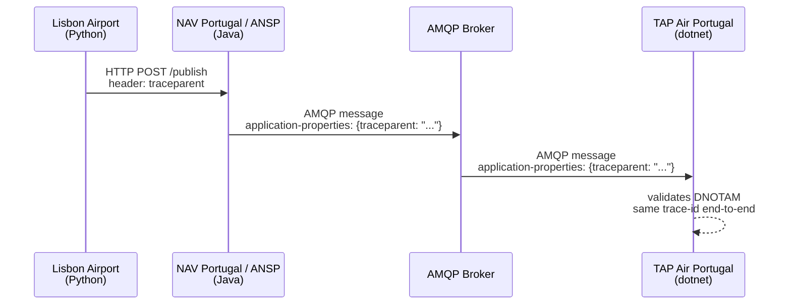

# Observability for SWIM — SFG Proposal

**Open source demo** · [swim-sfg-observability](https://github.com/swim-developer/swim-sfg-observability)

---

## The Central Message

> **This demo is not about OpenTelemetry. It is not about Grafana. It is not about any specific tool.**
>
> It is about a **string**. A 55-character string called `traceparent`, defined by the W3C.
>
> That string, carried in HTTP headers and in AMQP Application Properties, gives any organisation — using any technology — the ability to follow a transaction across every service, every protocol, and every organisational boundary.
>
> **We are proposing that SPEC-170 standardises where that string lives in each protocol binding. Nothing more.**

---

## The Problem

A SWIM transaction crosses multiple organisations, multiple protocols, and multiple systems.

Today, when something goes wrong, each organisation sees only its own fragment.  
There is no standard way to answer: *"Where exactly did this DNOTAM fail, and who was responsible?"*

---

## What is `traceparent`?

`traceparent` is a W3C standard (not an OpenTelemetry invention). It is a single string with four fields:

```
traceparent: 00-4bf92f3577b34da6a3ce929d0e0e4736-00f067aa0ba902b7-03
             │   │                                │                │
             │   │                                │                └─ flags
             │   │                                │                   01 = sampled
             │   │                                │                   03 = sampled + random trace-id
             │   │                                └─ parent-span-id (16 hex chars)
             │   │                                   ID of the span that sent this message.
             │   │                                   Changes at every service hop.
             │   │                                   Used to reconstruct the call hierarchy.
             │   └─ trace-id (32 hex chars)
             │      The transaction identifier. Generated once at the origin.
             │      NEVER changes. This is the correlation key that crosses
             │      every protocol boundary and every organisation.
             └─ version (always 00 in the current W3C spec)
```

### The one rule to remember

| Field | Changes? | Why |
|---|---|---|
| `trace-id` | **Never** | It is the identity of the whole transaction |
| `parent-span-id` | **At every hop** | Each service stamps its own span ID before passing it on |

The `trace-id` is what links Lisbon Airport → NAV Portugal → TAP Air Portugal under one searchable identifier.  
The `parent-span-id` is what lets a tool like Grafana draw the parent→child waterfall.

### This is not OpenTelemetry

OpenTelemetry is one implementation of this standard. Zipkin, Datadog, and any custom code that reads and writes this string are equally compliant. The standard is W3C. The wire format is a plain string. No SDK required to be interoperable.

---

## The Proposal

Add `traceparent` as a wire-level requirement to EUROCONTROL SPEC-170:

- In **HTTP** → standard `traceparent` header (W3C, already widely used)
- In **AMQP 1.0** → `application-properties` section of the message envelope, key `traceparent`

The aviation payload is **never modified**. The DNOTAM body, AIXM, FIXM — untouched.  
The `traceparent` travels in the protocol envelope, not inside the message content.

---

## How It Works

Three organisations. Three languages. One `trace-id`.



The broker forwards `application-properties` unchanged.  
No AMQP 1.0 broker modification is required.

> **Key point:** the three services use completely different technology stacks and run in independent environments. The `trace-id` does not break at the HTTP→AMQP boundary because it travels in the protocol envelope — not in the aviation payload. Any AMQP 1.0 client, in any language, from any vendor, can read and write it. Interoperability requires only the wire format, not a shared SDK or platform.

### Why this demo uses OpenTelemetry

The demo uses the OpenTelemetry SDK in all three services. This was a deliberate choice to show **how little effort is required**.

Adding the OpenTelemetry library to a project is the entire implementation. There is no manual code to create the `traceparent` string, no code to inject it into HTTP headers, no code to extract it from AMQP Application Properties and pass it to the next service. The library does all of this automatically and transparently, in the background, the moment it is added to the classpath.

The developer writes business logic. The library handles the wire format.

This is also not an exclusive choice. The same result can be achieved with any library — or with no library at all, by writing the 55-character string directly. OpenTelemetry is the reference implementation because it is the most widely adopted open-source option. The wire behaviour is identical regardless of which tool writes the string.

**The simplicity of implementation is part of the argument.** If standardising two strings in SPEC-170 is the requirement, and adding one library to a project is the implementation cost, the effort-to-benefit ratio is exceptional.

---

## The Global View

Each organisation runs its own observability stack.  
No organisation shares internal logs with others.

An OTel Collector at each site forwards sanitised spans — stripped of internal infrastructure data — to a **Federation Hub**.

The Hub reconstructs the full transaction chain from the shared `trace-id`:

```
trace-id: 4bf92f3577b34da6a3ce929d0e0e4736

  ├── lisbon-airport     · dnotam-originator   · 12ms   ✓
  ├── nav-portugal       · dnotam-publisher    · 8ms    ✓
  └── tap-air-portugal   · dnotam-consumer     · 5ms    ✗ VALIDATION_FAILURE
```

One question. One answer. Across all organisations.

---

## What We Are Asking SPEC-170 to Add

| Protocol | Location | Keys |
|---|---|---|
| HTTP | Standard header | `traceparent`, `tracestate` |
| AMQP 1.0 | Application Properties | `traceparent`, `tracestate` |

No vendor mandated. No SDK mandated. Any implementation that writes these strings is compliant.  
The standard is W3C — it already exists.

---

## Live Demo

- Valid DNOTAM → green trace → three organisations, one `trace-id`
- Invalid DNOTAM (wrong runway) → red span → exact failure point, exact organisation identified

**Stack used in this demo:** Python · Java/Quarkus · dotnet · ActiveMQ Artemis · Grafana · Tempo · Loki  
**These are not the proposal.** They are one possible implementation. Any compliant stack works.

