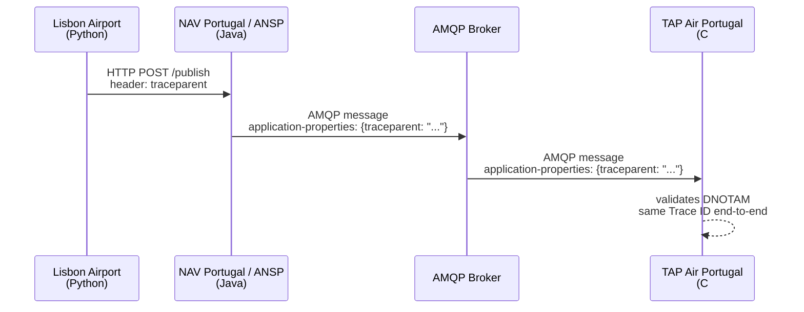

# Observability for SWIM — SFG Proposal

**Open source demo** · [swim-sfg-observability](https://github.com/swim-developer/swim-sfg-observability)

---

## The Problem

A SWIM transaction crosses multiple organisations, multiple protocols, and multiple systems.

Today, when something goes wrong, each organisation sees only its own fragment.  
There is no standard way to answer: *"Where exactly did this DNOTAM fail, and who was responsible?"*

---

## The Proposal

Add **W3C Trace Context** as a wire-level requirement to EUROCONTROL SPEC-170.

One string travels with every message:

```
traceparent: 00-4bf92f3577b34da6a3ce929d0e0e4736-00f067aa0ba902b7-03
                  └─────────────── Trace ID ──────────────────┘
```

- In **HTTP** → standard `traceparent` header
- In **AMQP 1.0** → `application-properties` section of the message envelope

The aviation payload is **never modified**. The Trace ID travels in the protocol envelope.

---

## How It Works

Three organisations. Three languages. One Trace ID.



The broker forwards `application-properties` unchanged.  
No AMQP 1.0 broker modification is required.

---

## The Global View

Each organisation runs its own observability stack.  
No organisation shares internal logs with others.

An **OTel Collector** at each site forwards sanitised spans — stripped of internal infrastructure data — to a **Federation Hub**.

The Hub reconstructs the full transaction chain from the shared Trace ID:

```
Trace ID: 4bf92f3577b34da6a3ce929d0e0e4736

  ├── lisbon-airport     · dnotam-originator   · 12ms   ✓
  ├── nav-portugal       · dnotam-publisher    · 8ms    ✓
  └── tap-air-portugal   · dnotam-consumer     · 5ms    ✗ VALIDATION_FAILURE
```

One question. One answer. Across all organisations.

---

## What We Are Asking SPEC-170 to Add

| Protocol | Location | Keys |
|---|---|---|
| HTTP | Standard header | `traceparent`, `tracestate` |
| AMQP 1.0 | Application Properties | `traceparent`, `tracestate` |

No vendor mandated. No SDK mandated. Any implementation that writes these strings is compliant.  
The standard is W3C — it already exists.

---

## Live Demo

- Valid DNOTAM → green trace → three organisations, one Trace ID
- Invalid DNOTAM (wrong runway) → red span → exact failure point identified

**Stack:** Python · Java/Quarkus · C#/.NET · ActiveMQ Artemis · Grafana · Tempo · Loki
